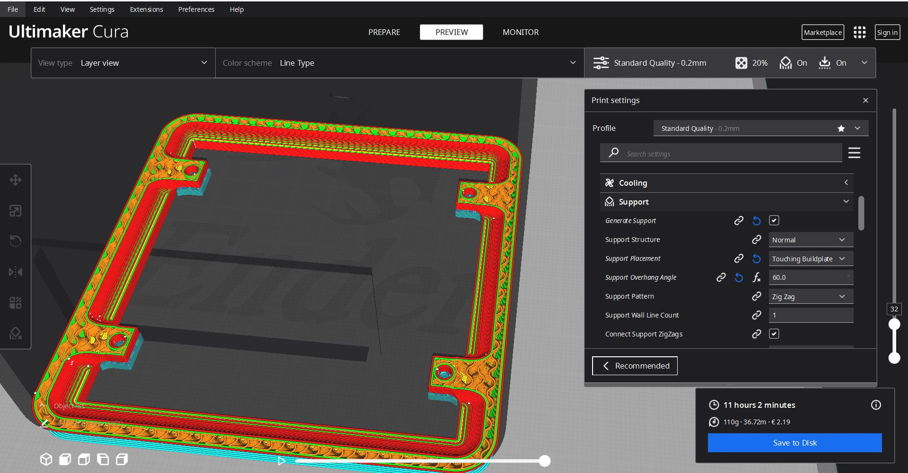
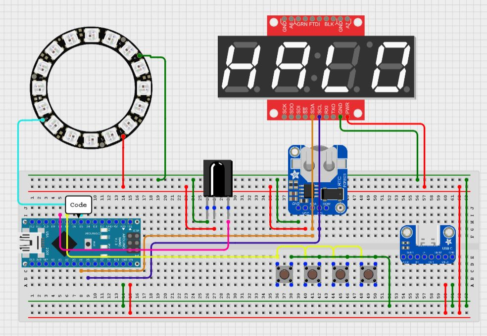
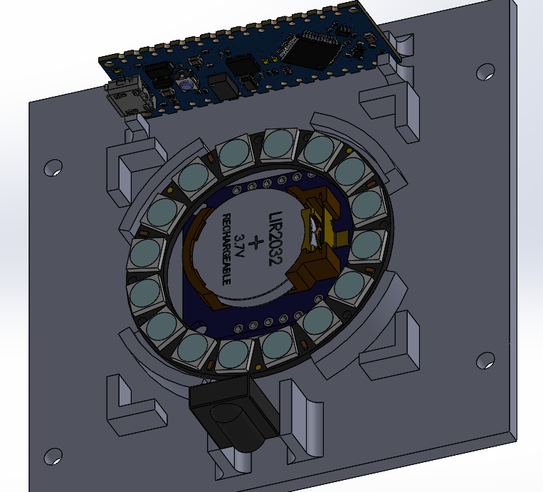
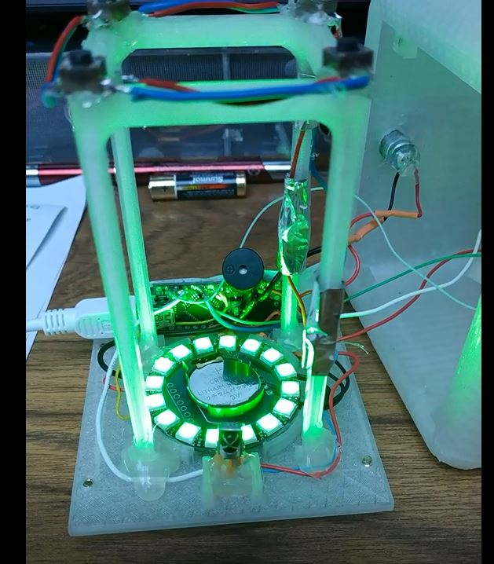

# arduino_sunrise_clock
I made this project to mimic the comercial sunrise clock that you can buy online but cheaper (at least it was cheaper in 2018)

This clock has two mains functions: 
- Anbiant RGB light with a large range of colors
- Sunrise mode which increase light gradually for 30 minutes

There is only one button on the top of the device which is used for:
- Switching ON/OFF the 7 segment display
- Switching OFF the ambiant light 
- Switching OFF the sunrise 

The others settings can be change with the remote control:
- Increse/decrese R G and B independetly and gradually
- Setting the time
- Setting the alarm clock
- Switching ON/OFF the alarm clock
- Switching ON/OFF the ambiant light

# Part list
| Part | Quantity | Cost |
|- | - | - |
| Arduino Nano | 1 | 5€ |
| RTC module | 1 | 3€ |
| RGB led ring | 1 | 4€ |
| USB-C connector | 1 | 1€ |
| 7 segments 4 digits display | 1 | 5€ |
| IR remote + reciever | 1 | 2€ |
| Push button | 4 | 0.1€ |
| Clear filament spool | 1 | 20€ |

Any RTC module would work but the DS3231 is the more compact and reliable (I've used the DS1307)
When I built this clock the 0.78 inches (high not diagonal) 7 segments display cost something like 3-5€ but I couldn't find any now...
It can be replaced by an OLED screen or a smaller 7segment display 


# 3D printing

The 3D files can be found [here] as stl and step if you want to adapt the design

The files are printed in clear filament which isn't clear but can difuse light efficiently.
Since any pieces are under constraint 2-3 wall are enougth but be carrefull to choose the right infil patern because it will be visible from the outside! 
I've choose to use a concentric infill patern for the top piece and a grid for the perimeter but feel free to try something elese (gyroid is a good alternative).

As always, I use 0.16 layer high with adaptative layers enable (0.12-0.2) and support arent needed for the screen holder only the 4 small pins need support from builplate like that:



# Wirring

Since the arduino nano can't deliver much more than 500mA trought the 5V pin and all output conbine, I'll recomande you to connect the 5V and ground of the LED ring and the 7 segment display directly to the USB-C connector.

- RTC clock is connected whith I2c so you just have so solder some wires between SDA - A4 and SCL - A5
- The ring is connected to a pwm output 
- The display is connected to 2 pwm output but depend of the model and can be connected with I2c as well
- The IR reciever is connected to any pin you want
- The push button is connected to a random input pin
- The USB-C breakout board is obviously connected to Vin and Ground and as mentionned before the led ring and the display




# Assembly

All the components should fit easly on the bottom piece, a little bit of hot glue is required to maintain everything in place.




The only tricky part is to place the pushbutton, just place it in the shell upside down and then place the assembly with all the electronics parts


---
# tropfort
[read the wiki here](https://github.com/index-machines/index/wiki)
```
bl  blalala
```

